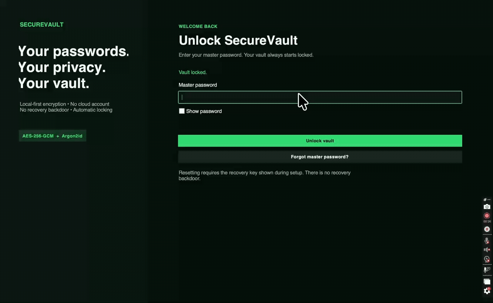

## 🔐 SecureVault

SecureVault is a secure desktop password manager built with Python, Tkinter, SQLite, Pydantic, Argon2id, and AES-256-GCM. It lets you save and search accounts, generate strong passwords, check your vault’s security, and create encrypted backups.


## Features

- Master-password setup and unlock with Argon2id hashing
- Guided forgotten-password reset using the recovery key
- AES-256-GCM authenticated encryption for website, username, password, and notes
- Random per-vault data key protected by password-derived and recovery-derived keys
- Failed-login lockout after five attempts
- Recovery lockout after five incorrect recovery-key attempts
- Automatic locking after inactivity
- Timed clipboard clearing for copied secrets
- Add, view, edit, search, filter, favorite, and delete account records
- Password visibility controls and customizable secure generator
- Memorable passphrases such as `River-Mango-Planet-47`
- Password strength, reuse, age, and missing-notes health checks
- Encrypted backup and authenticated restore
- Configurable inactivity, clipboard, and password-age thresholds

## Demo Walkthrough



## Heads Up

The first time you open SecureVault, it creates your vault and shows you a
recovery key once. Save it somewhere safe and offline—if you lose both your
master password and recovery key, your vault cannot be recovered.

## How it works

### 1. Create your vault

The first time SecureVault opens, it asks you to create a unique master
password of at least 12 characters. A strength meter helps you choose a safer
password or passphrase.

SecureVault never saves the master password. It uses Argon2id and a random salt
to create a verifier that can confirm future login attempts without revealing
the original password.

### 2. Save your recovery key

Setup displays a high-entropy recovery key once. Store it somewhere separate
from your computer, such as a locked physical location. If you forget the
master password, this key can unlock the vault and let you set a new one.

There is no administrator override or hidden reset link. Losing both the master
password and recovery key means the encrypted vault cannot be opened.

### Forgot your master password?

You do not need the old master password if you still have the recovery key:

1. Open SecureVault and select **Forgot master password?**
2. Enter the recovery key saved during setup.
3. Create and confirm a new master password.
4. Select **Reset password and unlock vault**.

SecureVault verifies the recovery key, protects the existing vault data key
with the new master password, clears any temporary login lockout, and unlocks
the vault. All saved accounts remain unchanged. The old master password will no
longer work, while the saved recovery key remains valid.

You have five chances to enter the correct recovery key. The app shows how many
attempts remain after each failure. Five incorrect keys pause recovery for 30
seconds before another attempt is allowed. A weak or mismatched new password
does not use a recovery chance; simply correct the form and try again.

If the recovery key is also missing, SecureVault cannot reveal, bypass, or
replace the forgotten password. This limitation is intentional: a reset without
the recovery key would also give an unauthorized person a way into the vault.

### 3. Unlock the vault

When the correct master password is entered, SecureVault derives a key with
Argon2id. That derived key unlocks the vault's 256-bit data-encryption key in
memory. The data key is never stored without protection.

```text
Master password
      │
      ▼
Argon2id key derivation
      │
      ▼
Unlock vault data key
      │
      ▼
Decrypt records only while the vault is open
```

Five failed login attempts start a temporary lockout. Closing the application,
pressing **Lock vault**, or reaching the inactivity limit removes the active key
from the application and returns to the unlock screen.

### 4. Add and manage accounts

Use **Add account** to save a website, username, password, category, tags, notes,
and favorite status. Website URLs, usernames, passwords, and notes are encrypted
with AES-256-GCM before SQLite receives them.

From the main vault screen, you can:

- Search by account, website, username, category, or tag
- Filter accounts by category or favorite status
- View, edit, and delete saved accounts
- Reveal a hidden password only when needed
- Copy usernames and passwords with automatic clipboard clearing

- AES-GCM also authenticates every encrypted value. If encrypted information is
damaged, changed, or opened with the wrong key, SecureVault rejects it instead
of returning untrusted text.

### 5. Generate stronger passwords

The password generator uses Python's `secrets` module for cryptographically
secure randomness. You can choose the length and whether to include uppercase
letters, lowercase letters, numbers, and symbols. Confusing characters such as
`O`, `0`, `l`, and `1` can be excluded.

Passphrase mode combines random words and a number into a memorable result such
as `River-Mango-Planet-47`. Generated passwords use the same timed clipboard
protection as saved passwords.

### 6. Check vault health

The health dashboard checks passwords locally and reports:

- Weak passwords
- Passwords reused across multiple accounts
- Passwords older than the configured age limit
- Accounts without notes or recovery information
- An overall vault-health score

Passwords are never sent to an external service. Password fingerprints used for
reuse detection exist temporarily in memory only while the vault is unlocked.

### 7. Back up and restore

The settings screen creates an encrypted `.svbackup` file. A copied backup does
not expose its credentials because its contents remain authenticated and
encrypted with the vault data key.

A backup can only be restored while its original vault is unlocked. SecureVault
verifies every encrypted field before replacing the current account records.
Keep backup files in a separate, protected location.


## Security model - explained.

Your master password is never saved. Instead, the app uses Argon2id and a unique random salt to verify that the password you enter is correct. Your saved website URLs, usernames, passwords, and notes are encrypted before they are stored in the SQLite database. AES-GCM also helps detect whether encrypted information has been changed or unlocked with the wrong key.

During setup, the app gives you a strong recovery key. This key protects the same encryption key as your master password, but through a separate recovery method. It is only shown once and is never stored as readable text, so you must save it somewhere safe. There is no secret backdoor for recovering your vault.

Some basic information such as account names, categories, tags, dates, and favorite settings remains unencrypted so the app can organize and sort your accounts. Sensitive details remain encrypted. When you search sensitive fields, the app temporarily decrypts the information in memory only after the vault has been unlocked.

Although this educational app uses trusted security methods, it has not been professionally audited. Before using it in a real world, high-security environment, it should receive an independent security review and additional protections, such as secure device storage and digitally signed releases.

## Run the app

Python 3.11 or newer is recommended.

```bash
python3 -m venv .venv
source .venv/bin/activate
python -m pip install -r requirements.txt
python app.py
```
